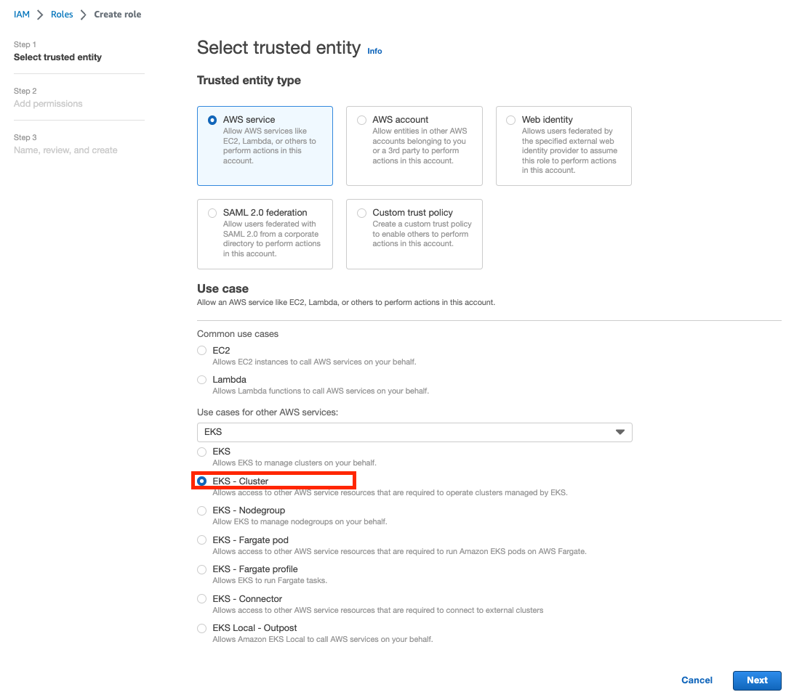
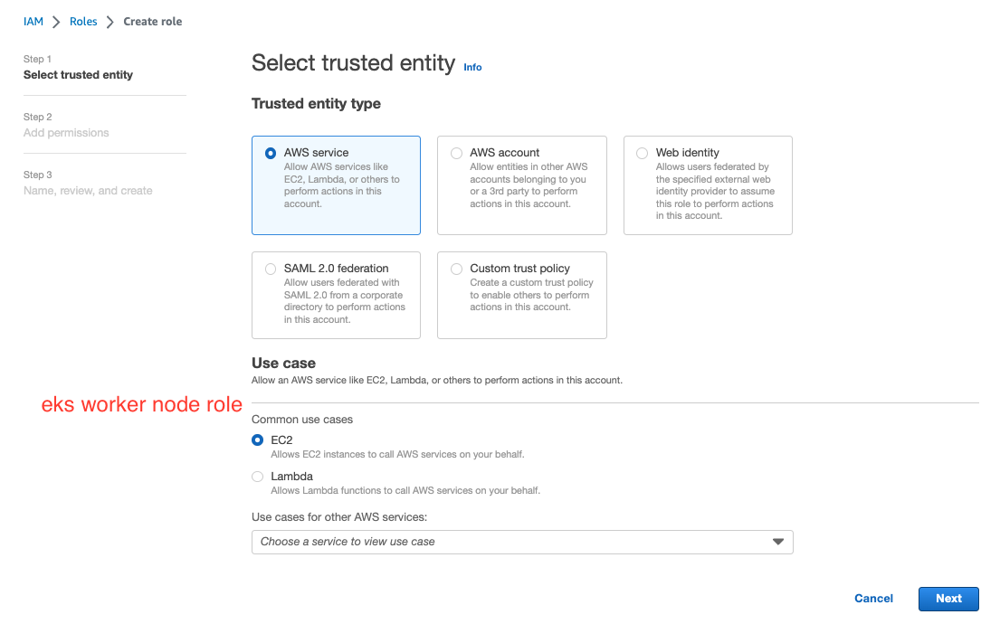
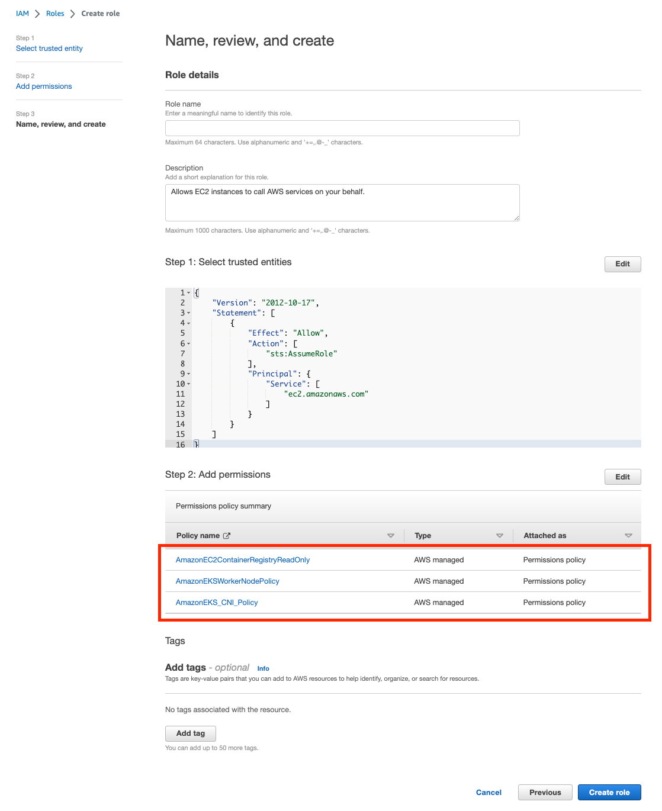

# aws-notes

## Setup EKS

1. Create AWS account
2. Create a VPC
3. Create an [IAM role](https://ukayzm.github.io/aws-create-iam-user/) with Security Group (create AWS user with list of permissions)

4. Install awscli

```
brew install awscli
```

check configure list
```
aws configure list
```

Set `aws_access_key_id` and `aws_secret_access_key`

```
vi ~/.aws/credentials
```

5. Install kubectl

First remove older version kubectl if you have
```
brew uninstall kubernetes-cli
which kubectl
sudo rm /usr/local/bin/kubectl
```

Than, install [kubectl](https://docs.aws.amazon.com/eks/latest/userguide/install-kubectl.html) 

```
curl -O https://s3.us-west-2.amazonaws.com/amazon-eks/1.26.4/2023-05-11/bin/darwin/amd64/kubectl
chmod +x ./kubectl
mkdir -p $HOME/bin && cp ./kubectl $HOME/bin/kubectl && export PATH=$HOME/bin:$PATH
kubectl version --short --client
```

6. Create IAM role for EKS cluster



7. Create EKS Worker Node Role





8. Create VPC and Subnet 

Use [cloudFormation Stack](https://potato-yong.tistory.com/126)

9. Create EKS Cluster

